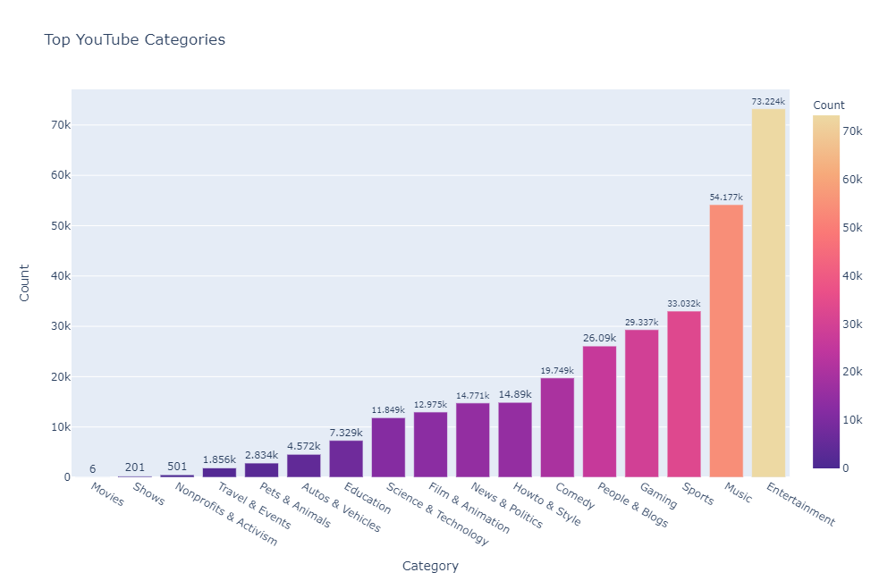
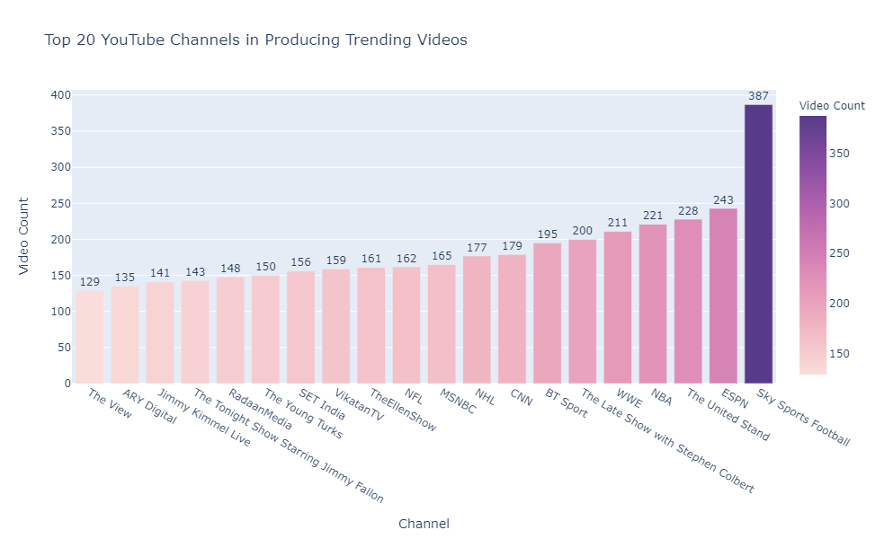
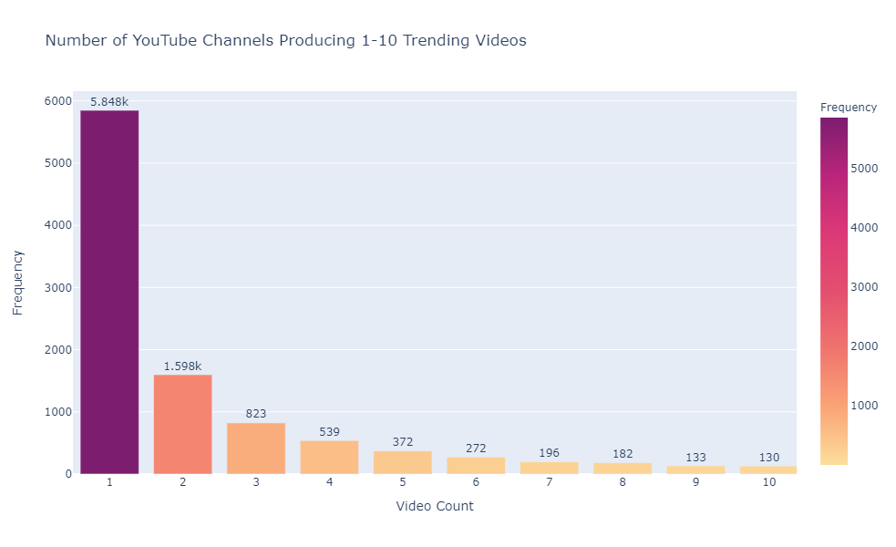
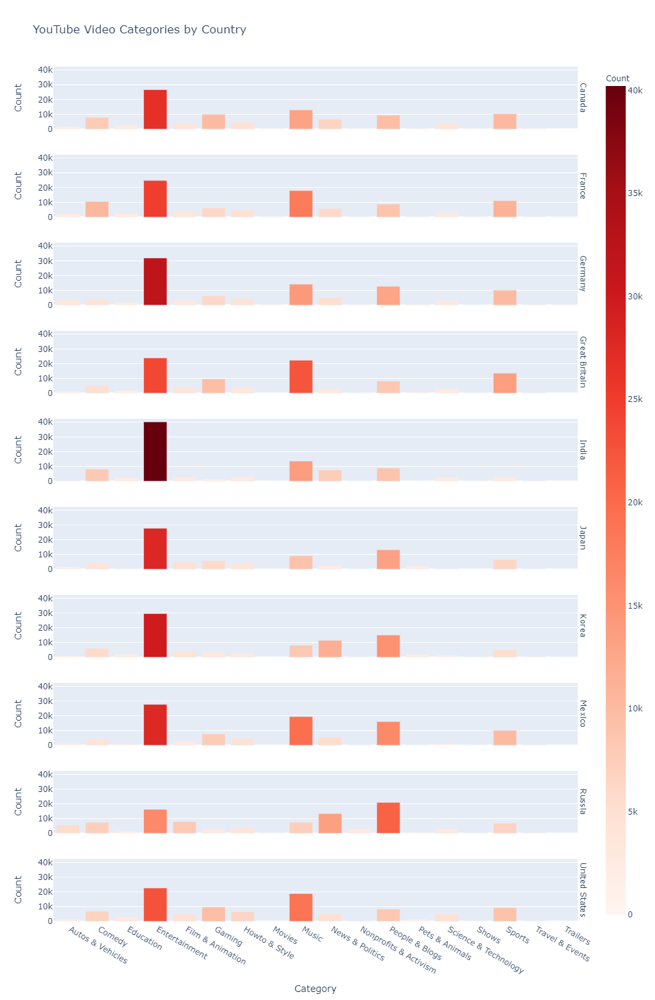

# YouTube Data Analysis with MapReduce
This project demonstrates the application of big data analytics on YouTube trending video data using Apache Hadoop and tools in the Hadoop ecosystem. Apart from obtaining insights for several analysis questions, this project also sets out to evaluate the performance of analyses between the conventional method and big data approach (MapReduce) to explore their suitability under different analytical requirements.


<details>
  <summary>Table of Contents</summary>
  
  1. [Introduction to Analysis](#introduction-to-analysis)
  2. [Setup](#setup)
  3. [Data Source](#data-source)
  4. [Data Preprocessing](#data-preprocessing)
     * [Part 1](#part-1)
     * [Part 2](#part-2)
     * [Download Preprocessed Datasets](#download-preprocessed-datasets)
  5. [Usage](#usage)
  6. [Performance Evaluation](#performance-evaluation)
  7. [Results Interpretations](#results-interpretations)
  8. [Contributors](#contributors)
  9. [License](#license)
</details>


# Introduction to Analysis
Four analyses are performed to answer the following questions based on the YouTube trending video data:

* **Analysis 1**: What terms are commonly used in YouTube trending videos’ titles?
* **Analysis 2**: What are the top categories of YouTube trending videos?
* **Analysis 3**: Which YouTube channels frequently produce trending videos?
* **Analysis 4**: What are the top categories of YouTube trending videos in different countries?

Dataset descriptions and data source are available [here](#data-source).

***Note**: Analysis 1 - 3 focuses on countries communicating mainly in English (Canada, US, UK) due to the limitation in processing and analyzing foreign languages*


# Setup
Compute:
* 3 AWS EC2 intances (1 master node, 2 slave nodes) 
* Instance type: t2 medium

Installations:
* [Apache Hadoop 3.2.2](https://hadoop.apache.org/release/3.2.2.html)
* [Apache Hive 3.1.2](https://hive.apache.org/downloads.html)
* [mrjob](https://mrjob.readthedocs.io/en/latest/)

Guide to setup EC2 Hadoop Cluster on AWS: 
* [Walkthrough - Setting up EC2 Hadoop Cluster on AWS](https://www.youtube.com/watch?v=9Oq3Vs9fy9c) by Prof. Lau Sian Lun :man_teacher:


# Data Source
Kaggle:
* Trending YouTube Video Statistics ([Nov 2017 - Jun 2018](https://www.kaggle.com/datasnaek/youtube-new?select=CAvideos.csv))
* YouTube Trending Video Dataset ([Aug 2020 - Present](https://www.kaggle.com/rsrishav/youtube-trending-video-dataset?select=BR_youtube_trending_data.csv))

***Note**: Cutoff date of data collection for this project is 14/06/2021, i.e. data used in this project is only up to 14/06/2021*


# Data Preprocessing
To simulate the application of big data analytics, the following steps are performed to combine the datasets and produce a relatively larger file:

### Part 1
```Data Preparation.ipynb``` prepares data for ```analysis_n_x.py``` <br>
```n```: 1/ 2/ 3 <br>
```x```: mrjob/ norm

**File Level**
1. Resolved 2017-2018 data encoding issue:
    * Converted ANSI encoding to utf-8 using Notepad++ (for Japan, Korea, Mexico and Russia data)
2. Deleted Brazil’s dataset from 2020-2021 data as 2017-2018 data does not contain
dataset for Brazil. This is to maintain the consistency of the countries in both time
periods.

**Data Level**
1. Dropped columns that exist in either one of the dataset but not both datasets.
    * Column dropped for 2017-2018: “video_error_or_removed”
    * Column dropped for 2020-2021: “channelID”
2. Added the column “country” as an identifier for the country that the rows belong to.
3. Standardized the “publishAt” and “publish_time” date format.
4. Merged “category_id” with category extracted from JSON files containing category data. Null values occurred for rows with “category_id” 29, which represented “Nonprofits & Activism”. Thus this category was added during the merging process.
5. Renamed column names and rearranged column positions to ensure both datasets are compatible to append/ concatenate.
6. Combined all datasets and produced the final dataset with approximately 1.5GB of file size.

### Part 2
```Data Preparation 2.ipynb``` prepares data for ```analysis_4_x.py``` <br>
```x:```: hive/ mrjob/ norm

1. Similar steps with Part 1.
2. Removed columns “title”, “channelTitle”, “tags”, and “description” to reduce the complexity of importing data with inconsistent delimiters. 
3. Upsampled the dataset by duplicating the data 10 times to retain a relatively larger data file size of approximately 1.5GB.

### Download Preprocessed Datasets
The preprocessed datasets are available for download (refer to guide under the Usage section).


# Usage
1. Start the Hadoop cluster
```
$ start_all.sh
```

2. Download the repo
```
$ wget https://github.com/Longannn/MapReduce/archive/refs/heads/main.zip
```

3. Unzip the file
```
$ unzip main.zip
```

4. Change directory into the ```MapReduce-main``` folder
```
$ cd MapReduce-main
```

5. Download the preprocessed dataset
```
$ bash setup.sh
```

6. Upload the datasets into HDFS 
```
$ hadoop fs -mkdir data
$ hadoop fs -put ./data/*.csv data
```

7. Run analysis with timing output in the  ```MapReduce-main``` folder
    * Conventional python (codes with ```norm``` suffix)
    ```
    $ time python3 analysis_1_norm.py 
    ```
    * MapReduce using Hadoop cluster (codes with ```mrjob``` suffix)
    ```
    $ time python3 analysis_1_mrjob.py -r hadoop hdfs:///user/hadoop/data/combined_all.csv --output hdfs:///user/hadoop/a1output
    ```

8. Run analysis with Hive: ```comparison_hive.hql``` <br>
   _**Note: Initial setup should only be run once for the first time**_
    * Initial setup - remove conflicting jar files 
    ```
    $ rm /home/hadoop/hive-3.1.2/lib/log4j-slf4j-impl-2.10.0.jar
    $ rm /home/hadoop/hive-3.1.2/lib/guava-19.0.jar
    ```
    * Initial setup - update guava library in Hive to be the same as Hadoop 
    ```
    $ cp /home/hadoop/hadoop-3.2.2/share/hadoop/common/lib/guava-27.0-jre.jar /home/hadoop/hive-3.1.2/lib/
    ```
    * Initial setup - initiate schema
    ```
    $ schematool -initSchema -dbType derby
    ```
    * Run HiveQL code
    ```
    $ hive -f comparison_hive.hql
    ```


# Performance Evaluation
The following tables show the time taken to execute Analysis 1, 2, 3 using conventional method and MapReduce and the time taken to execute Analysis 4 using conventional method, MapReduce and MapReduce with Hive. Three attempts are made for each analysis and the average time taken is calculated.

### Analysis 1

Attempt      | Conventional  | MapReduce  | 
------------ | ------------- | ---------- | 
1            | 22m 33.567s   | 3m 20.400s |
2            | 22m 2.635s    | 3m 19.298s |
3            | 21m 56.755s   | 3m 15.358s |
**Average**  | 22m 10.986s   | 3m 18.352s |

### Analysis 2

Attempt      | Conventional  | MapReduce  |
------------ | ------------- | ---------- | 
1            | 0m 26.003s    | 3m 1.987s  |
2            | 0m 25.249s    | 2m 52.843s |
3            | 0m 25.197s    | 2m 55.391s |
**Average**  | 0m 25.483s    | 2m 56.740s |

### Analysis 3

Attempt      | Conventional  | MapReduce  |
------------ | ------------- | ---------- | 
1            | 4m 32.977s    | 3m 38.313s |
2            | 4m 30.772s    | 3m 15.837s |
3            | 4m 31.424s    | 3m 24.148s |
**Average**  | 4m 31.720s    | 3m 26.100s |

### Analysis 4

Attempt      | Conventional  | MapReduce    |    Hive    |
------------ | ------------- | ------------ | ---------- |
1            | 0m 34.307s    | 2m 39.445s   | 1m 0.875s  |
2            | 0m 33.893s    | 2m 31.260s   | 1m 3.830s  |
3            | 0m 33.575s    | 2m 12.982s   | 1m 0.670s  |
**Average**  | 0m 33.930s    | 2m 27.900s   | 1m 1.790s  |

For analysis 2, the conventional method completed faster than MapReduce. This may be due to the relatively simple task in counting the categories that the conventional method handled well even with a large data file. 

However, for Analysis 1 and 3 which were more complex, the advantage of parallel processing using MapReduce can be clearly noticed.

For analysis 4, the conventional method took the shortest time, while MapReduce took the longest time to complete the analysis. Hive was expected to consume a longer time compared to MapReduce due to the latency caused by translating HiveQL to MapReduce jobs. However, Hive performed better than MapReduce in this analysis. 

Although this analysis 2 and 4 did not demonstrate the expected output, it presented the case that performing a simple analysis on a dataset of 1.5GB, the conventional method may still operate well and Hive may still perform better than MapReduce. Further testing with more complex analyses may be conducted in the future to observe the effect of the possible latency with Hive to generate MapReduce jobs.

# Results Interpretations 
The results of analyses conducted to answer to four questions [here](#introduction-to-analysis) are visualized using various charts and graphs for easy and effective interpretation. The data for all four analyses covers the range from November 2017 to June 2018 and August 2020 to June 2021. 

***Note**: Analysis 1 to 3 represents the aggregated data for countries that mostly communicate in English, which are **Canada**, **US** and **UK***

### Analysis 1
What terms are commonly used in YouTube trending videos’ titles?

<p align="center">
  
</p>

Observing the word cloud above, the words “highlights” and “episode” were noted to be the top 2 words commonly found among titles of trending YouTube videos. This possibly indicates that videos with contents like game highlights or show highlights were found to be commonly trending and also the trending videos are mostly related to episodes of different series. Words such as “trailer”, “official”, “music” and “new” also appeared frequently, hinting that videos released officially, trailers or music videos tend to attract viewers.

### Analysis 2
What are the top categories of YouTube trending videos?

<p align="center">
  
</p>

Observing the bar chart above, the entertainment category has the most videos with 73224 vidoes. In general, this shows that entertainment videos are significantly more likely to be trending in Canada, US and UK. As for the case of music category, many artists tend to release their official music video through YouTube on the launch of their new album or single as well as many other cover songs are also uploaded to YouTube. These videos also exhibited huge popularity amongst viewers that the music category has the second highest count with 54177 videos.

### Analysis 3
Which YouTube channels frequently produce trending videos?

<p align="center">
  
</p>

Based on the bar chart above, it can be noted that several **sports** related channels such as “Sky Sports Football”, “ESPN”, “The United Stand”, “NBA”, “WWE”, “BT Sport”, “NHL” and “NFL” frequently produces videos that are trending in Canada, US and UK. **Talk shows** channels such as “The Late Show with Stephen Colbert”, “TheEllenShow”, “The Young Turks”, “The Tonight Show Starring Jimmy Fallon”, “Jimmy Kimmel Live”, and “The View” also charted the trending videos list frequently.

<p align="center">
  
</p>

While there were channels producing large amounts of trending videos as illustrated in the bar chart above, most YouTube channels (around 5848 channels) have produced only one trending video. The number of YouTube channels producing more than one trending video drops drastically, indicating the difficulty for YouTube channels to consistently produce videos that appeal to large audience crowds to become trending.

### Analysis 4
What are the top categories of YouTube trending videos in different countries?
 
<p align="center">
  
</p>

Based on the bar charts above, the entertainment related YouTube videos were found to be highly trending in almost all the 10 countries, except Russia. Besides, videos in the music category were found to be the second most trending videos in 6 of the countries, which are the United States, Mexico, Great Britain, Germany, France and Canada. This indicates that entertainment and music related YouTube videos are generally able to gain huge popularity regardless of countries.


# Contributors
This is a group project completed in collaboration with: <br>
<a href="https://github.com/Longannn/MapReduce/graphs/contributors">
  
</a>

Made with [contributors-img](https://contrib.rocks).


# License
Distributed under the MIT License. See ```LICENSE``` for more information.
